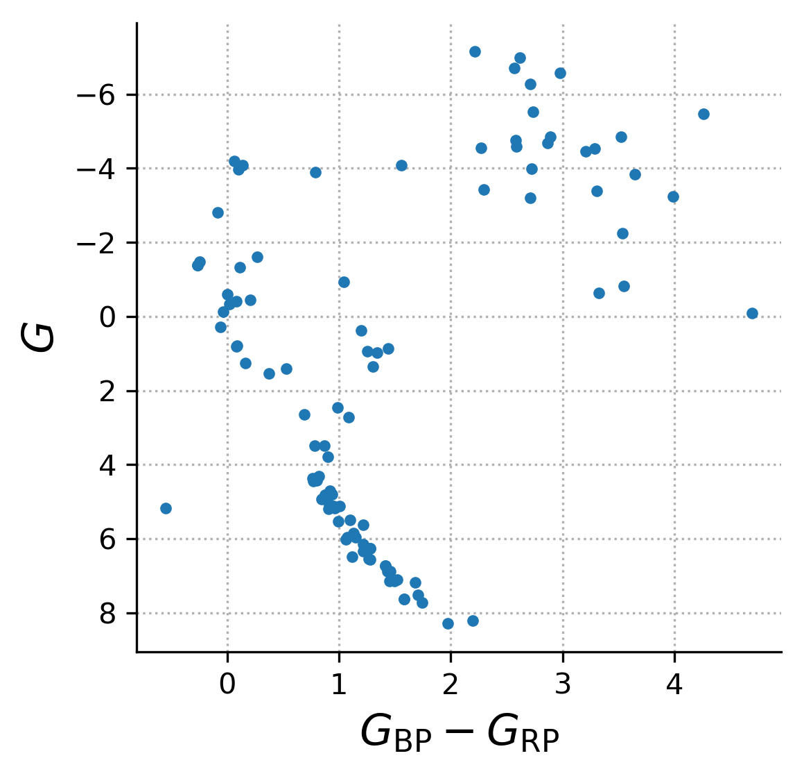

Next steps
==========

No plots, just exposure times
-----------------------------

You can also calculate the exposure time required to obtain a given S/N using
the `~arcesetc.signal_to_noise_to_exp_time` function. For example - how many
seconds must one expose ARCES on a V=12 mag M0V star to get a S/N of 30 at the
wavelength of H-alpha:

.. code-block:: python

    from arcesetc import signal_to_noise_to_exp_time
    import astropy.units as u

    sptype = 'M0V'
    wavelength = 6562 * u.Angstrom
    signal_to_noise = 30
    V = 12
    print(signal_to_noise_to_exp_time(sptype, wavelength, V, signal_to_noise))

This returns ``642.11444 s``, a `~astropy.units.Quantity` object containing the
required exposure time.

Available spectral types
------------------------

You can see which spectral types are available with the
`~arcesetc.available_sptypes` function.

.. note::

    At present, the best coverage is for mid-F through mid-M type main
    sequence stars, with some M giants.

Here's a color-magnitude diagram of the stars presently available in ``arcesetc``:

How it works
------------

We estimate the count rates for stars as a function of wavelength by fitting
15th-order polynomials to each spectral order of real observations of a star of
each spectral type. These polynomial coefficients and some wavelength metadata
are stored in an HDF5 archive for compactness and ease of reconstruction. Then
upon calling ``arcesetc``, the archive is opened and the spectral order closest
to the wavelength of interest is reconstructed from the polynomial
coefficients, for a star of the closest available spectral type to the one
requested.

.. warning::

    ``arcesetc`` doesn't know anything about saturation.

Run the tests
-------------

If you're contributing to ``arcesetc``, you can check that your updates don't
break the API by running the tests like this in the source directory::

    tox -e test

If the tests pass, you're ready to submit a pull request!
